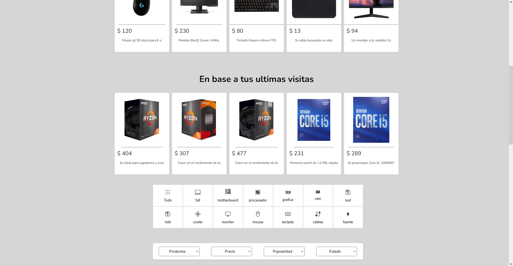
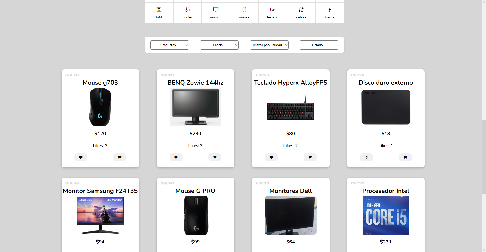
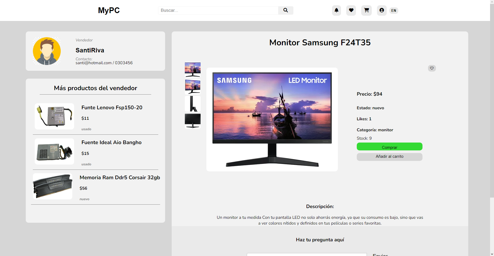
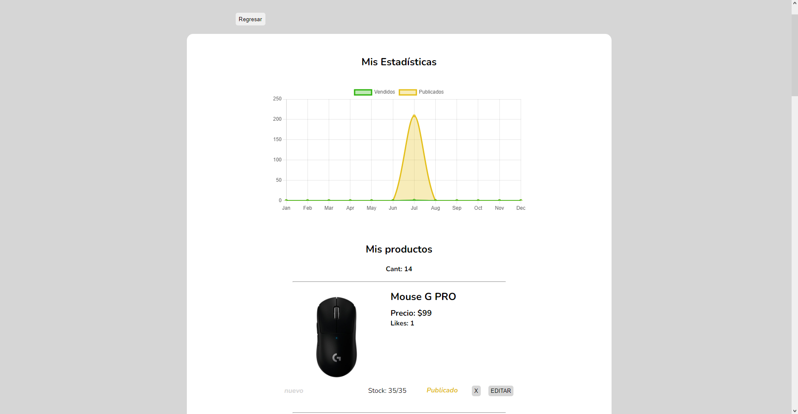
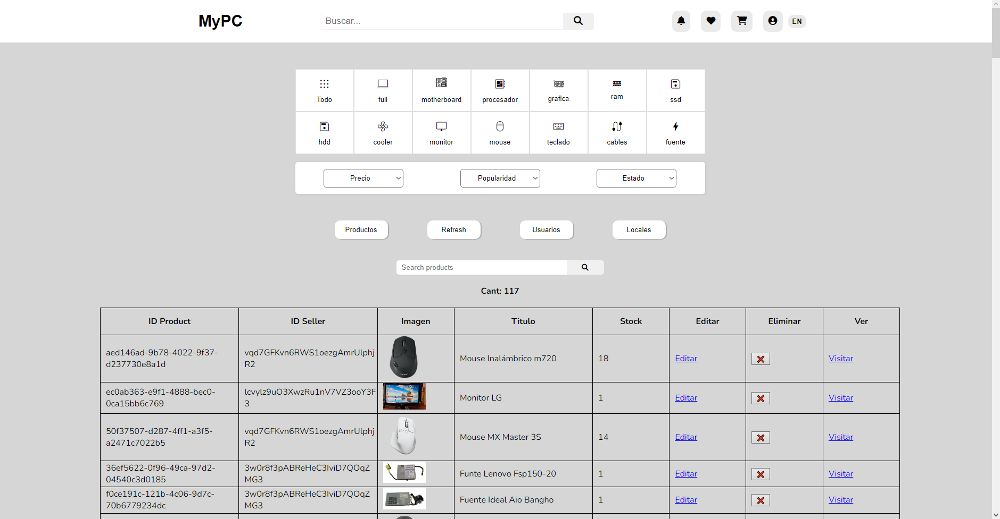

<h1 align="center">MyPC! 💻</h1>
<h3 align="center">MarketPlace de Componentes de PC  💃</h3>

<!-- ## 🙋‍♂️ Sobre mi

- 🔭 Actualmente trabajando en [Puppy Point](https://puppypoint.vercel.app/)

- 🌱 I’m currently learning **styled-components**

- 📫 How to reach me **leomoralesarce@gmail.com**

- ⚡ Fun fact **I play videogames.**

  -->

## ⚙️ Lenguajes y herramientas utilizadas:

 
<!--   -->
<h3>FrontEnd: </h2>
 

 
 
</a> 
 

<!--   -->
<h3>BackEnd: </h2>
 
 

 
<!--   -->
<h3>Testing: </h2>
 
<h3>Deploy: </h2>
 
 
<!--   -->

 

## 🚀 Caracterísitcas Principales (Ingles):
<a href="https://mypc.vercel.app" target="_blank" rel="noreferrer">
  MyPC
</a>
is a MarketPlace where you can view, buy and sell PC components. As a common user you can see their details, ask questions before buying, have a list of favorites and a cart. As a seller, you have a statistics section on your account, sales and publications for better monitoring of them. A chat between buyer and seller to coordinate details, accompanied by notifications within the App. 
We also provide an Admin account, which has a panel to manage and track accounts, products, vendors and more, with page statistics in general.
<!-- Countries App is a SPA (Single Page Application) in which all the countries of the world and their respective tourist activities can be viewed. -->
 
 

## 🚀 Caracterísitcas Principales:
<a href="https://mypc.vercel.app" target="_blank" rel="noreferrer">
  MyPC
</a>
es un MarketPlace en el cual puedes ver, comprar y vender componentes de PC. Como usuario común puedes ver los detalles de los mismos, hacer preguntas antes de comprar, tener una lista de favoritos y un carrito. Como vendedor tiene un apartado de estadísitcas sobre tu cuenta, ventas y publicaciones para un mejor seguimiento de las mismas. Un chat entre comprador y vendedor para coordinar detalles, acompañado de notificaciones dentro de la App. 
También proveemos una cuenta Admin, el cual cuenta con un panel para manejar y tener seguimiento de las cuentas, productos, vendedores y demás, con estadísticas de la página en general.
<!-- Countries App is a SPA (Single Page Application) in which all the countries of the world and their respective tourist activities can be viewed. -->
 
 
<!-- 
- Frontend: JS, React JS, Redux, React-router-DOM, Redux Thunk, HTML, CSS.
- Backend: Node JS, Express JS, Sequelize, Postgres, Axios.
- DataBase: SQL.
- Deploy: Vercel, Heroku. -->

 

  
  
  
  
  
  

<!-- 

  
  
  

 -->
<!-- 

<!-- ## 📊 My Github Stats

 

  

 
 
 
 
 
 
  -->

## Connect with us:

  Matias Jesus Contreras
  
  

  Lautaro Arnay
  
  

  Angel Vega
  
  

  Nicolas Rojo
  
  

  Tobias Daniel Alvarez
  
  

  Santiago Rivanegra
  
  

